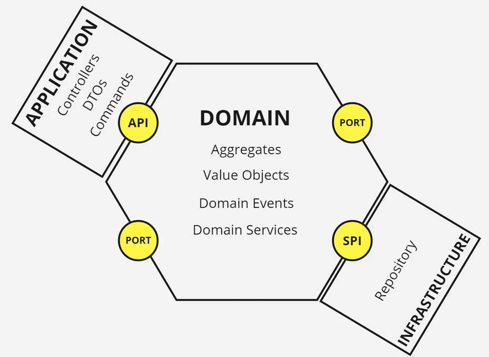

## Principles

A list of the development and architecture principles (e.g. coding conventions, separation of concerns, patterns, etc).

The core principles we follow is listed below, we try to keep it pragmatic to help us easily collaboarate to ship faster with confidence.

- Layered clean architecture (some kind of variation of Hexagonal architecture)
- Dependency Inversion (SOLID)
- Domain Driven  

It can be illustrated below:

### Structure
Inside the Nudge, we've been doing continuous refactoring (still not 100% finished), the core domain layer has been implemented to cover majority of nudge categories.

We've structuerd towards general 3-layer in the Nudge:
- **Inbound Application Layer:**  
  REST API, background jobs or Lambdas with registered handlers  
- **Domain Layer**:  
  Entities, DTO objects, aggregates, and domain service methods.
- **Infrastructure/Repository Outbound Layer**:  
 Data access, communicate with external service providers, and other integrations.

The rule of communication between layers:  
- Each layer should depend on contracts (typically interfaces) rather than concrete implementations  
  Application layer depends on contracts implemetned by domain layer, and domain depends on contracts implemented by Infra/Repo layer etc.  
  The concrete implementations are injected when application layer is bootstrapped.
- Domain entitites and DTO objects can cross boundary   
  No application or infrastructure details (e.g api request payload, db models and specific data types fro AWS client libs) should leak into the domain layer. It is the domain entities and DTO which can cross boundaries, and inside infra implementation it needs to convert domain objects to its specific data types required.

This ensure great testibility for different layers, and aslo allow us:
- Reuse stable domain layer in the different application runtime, where things are triggered 
- Swap out infra implementation without impacting other parts

More details can be found in next [06-Software-Arch](06-Software-Architecture.md)

### Audience
Technical people in the development team.