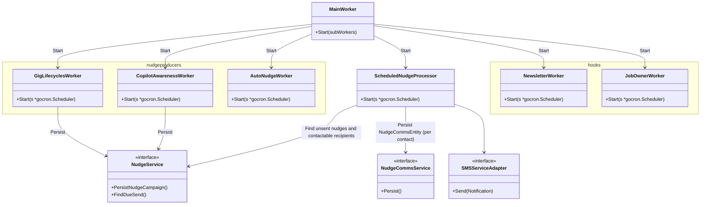

## Software Architecture

A description of the software architecture, including static structure (e.g. containers and components) and dynamic/runtime behaviour.

### Application Layer
Components in this layer are mostly handlers to be invoked when certain things are triggered, e.g upon receiving requests, time is up to triggered background jobs in the worker service, Lambda receiving events from the queue etc.

#### Bootstrap api service 
Inside the api service, all routers are defined in `pkg/api`, and bootstrapped from `cmd/api/main.go`

As you see when it comes to creating a new nudge, it will always depend on NudgeService interface to persist. Other routers provide endpoints to serve dashboard etc, which can directly depend on certain Repo interface if logic is simple to just query db result.

#### Bootstrap worker service 
Similarly, worker service instantiates all job runners (subworkers) are defined `pkg/workers`, bootstrapped from `cmd/worker/main.go`.  

- `SheduledNudgeProcessor`  
   It is a special one running in the same worker instance. It processes all unsent nduge entities produced from different sources, could be from api requests, or other sub workers. It mainly depends on both `NudgeService` to find, and store contact communications via `NudgeCommsService` methods.  

- Nudge Producers  
Other workers like `CopilotAwareness` or `GigLifecycleWorker` are considered nudge producers, it depends on same `NudgeService` to create and persist nudges in db, to be picked up by `ScheduledNudgeProcessor`

- Hooks  
  These are sent to HR users as described in [Functional Overview](02-Functional-Overview.md). All emails are sent from these workers directly without async processing.

#### Lambdas
Lambda will mutate nudge converstaions and customer's contact_commnications tables upon receiving any events related to emails through nudge apis. So Lambda is not aware of unerlying data schema and mutation logic, and no need to maintain same db connections as nudge api service already has the connection knowledge.

- `cmd/consumer/main.go`   
This creates `lambdas.OutgoingEmailHandler`. It consumes outgong sqs and call Pinpoint for each notifiaction event one by one. Update contact_communications with ref_id from Pinpoint (used to link reply, see below). The nudge api involved: `/api/communications/%commid`
- `cmd/analytics/main.go`  
This creates `lambdas.AnalyticsHandler`. It consumes analytics sqs and update nudge conversations and store event in the contact_communication_events. The nudge api: `api/conversations/:id/analytics`
- cmd/email_receiver/main.go  
This creates `lambdas.IncomingEmailHandler`. It will parse email content, extract reference id out of it and store attached files in S3 (if exists). Then it persists one reply communication record against original communication by looking up its reference id. The nudge api: `api/communications/reply`

### Domain Layer
They are defined in `internal/domain`, all the domain entities/DTO objects, services should be here.   
Currently we've implemented core logic related to nudge campaigns and manage their related communications, which can be reused to serve nudge categories triggered from differnt sources. We can gradually flesh out domain services if we identify more use cases.

The layer abstracts complext domain logic from application. Service methods serve aggregate roots to deal with `NudgeEntity`/`NudgeCommsEntity`, as they are always treated as a whole from business perspective:  

NudgeEntity always composes 1 nudge record linked with 1 campaign record. Same as NudgeCommsEntity composes 1 converstaion record (in nudge db) and 1 contact communication record in customer db.

### External Infra (Adaptor/Repository)
Repository can be seen as one type of Adaptors that specifically deal with external data access. They are located in `repos/{subfolder}` packages to be organised around data concerns. The implementations are mainly db related as we access data directly from db. 

NOTE: These in the diagram above are some core data access logic related to creating and processing nudges. We haven't migrated all repos to this structure. They exist under `pkg/repos` folder as individual source files. The implementation lacks proper abstraction, is coupled with concrete db types, more like table wrappers. We should plan to review them to follow the consistent structure as above. 

Similarly current external infra logic are implemented under `pkg/clients`, e.g pinpoint, sqs. Again they lack proper abstraction and did not conform to [Principles](05-Principles.md).  

We've started adapter implementation for new SMS communication. They are located in `internal/adapters`. We can split to sub packages based on external concerns.  

By following the principles, our interface exposed to other layers are infra agnostic. e.g `Notification` is DTO objects from domain layer. So it'd be easy to swap another provider to send nudges without impacting other parts. 

### Audience
Technical people in the development team.