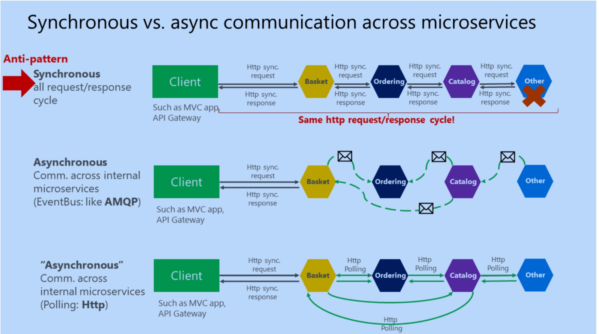
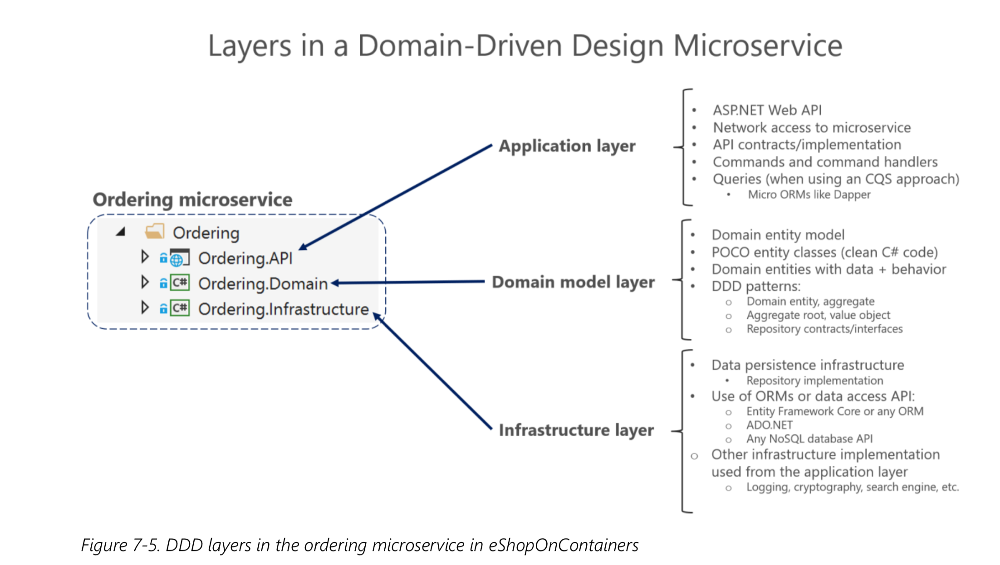
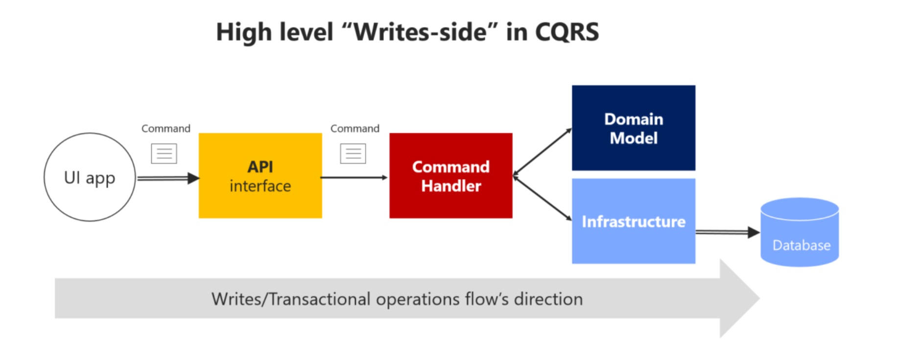
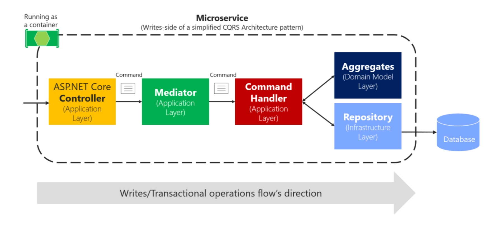

## The challenges 
As services mean the individual processes running in distributed environment (differnt servers and hosts). It poses a few chanllenges though the concerns are the same compared with monolithic app (components running in the same process). In the end, we still want loose coupling between services (autonomous), also high cohesion within each service. 

- How to define boundaries for each service  

- How to query data from several services  
  
  API Gateway (BFF), similar to Facade pattern in OO, instead of direct client-to-multi services

- How to achieve consistency across multi services 

  Do not directly update. Prefer async propagation of data updates 

- How to design communication across multi services  
  

  - REST Http (sync request/response pattern) for simiple interaction   
  
    As it is blocking, avoid creating long chains of HTTP calls, this makes system less performant and not resilient (fall into single point of failure) when any intermediate service is down.  
    Also services get coupled, they need to know a bunch of services to get job done. 

  - Async Messaging (AMPQ) for end-to-end business transaction

    One service receives the request from client, once processed (e.g write to DB or cache), it propagates the changes through message. Services will expect eventual consistency instead of real time update.

    Pub/Sub can be used for messages that have multi receivers. Similar to Observer pattern in OO, the main difference is Pub/Sub is in distributed env, has third party software (event bus or message broker) to connect with.
  
  ### Implement Event Bus (between services)

  Need to define a clear interface, and provide implementation based on the third party we used 
  ```cs
  public interface IEventBus {
    void Publish(IntegrationEvent @event);

    void Subscribe<T, TH>()
        where T : IntegrationEvent
        where TH : IIntegrationEventHandler<T>;

    void SubscribeDynamic<TH>(string eventName)
        where TH : IDynamicIntegrationEventHandler;

    void UnsubscribeDynamic<TH>(string eventName)
        where TH : IDynamicIntegrationEventHandler;

    void Unsubscribe<T, TH>()
        where TH : IIntegrationEventHandler<T>
        where T : IntegrationEvent;
  }

  public class EventBusRabbitMQ : IEventBus, IDisposable 
  {

  }
  ```
  > Design atomicity and resiliency
  
  How we handle message publish failing after DB gets updated?      
  The microservices need to choose availablity and tolerance over strong consistency. Instead, need mechanisms for eventual consistency.
  - Event Sourcing 
  - TBC


  ### Structure inside each service
  Each service can be structured as simple as exposing a set of REST interfaces for CRUD purposes, or more advanced DDD-Oriented CQRS (Command and Query Responsibility Segregation) to tackle complex business.
  

  - Repository pattern for actual data access logic   
    It separates the Domain layer from underlying infrastructure (how to communicate with DB storage, cache, queue or other infrastructure). This layer of abstraction hides the details from Domain, make it easy to test Domain logic (with DI-ed repo implementation into Domain layer, we can easily mock implementation)   

    ▪︎ Repo contracts (interfaces) defined in Domain layer   
    ▪︎ Repo implementation in infrastructure layer 

    The actual repo implementation could use any technology to communicate with underlying infra, ORM (Entity Core, Dapper or native NoSQL DB client)

  - Implement Application Layer with Web API   
    In simple case, we could just let App layer depend on repo implementation through DI, usually your web controller.  

    But in more complex case, we could have many Infra related implementations (repo/manager) with lots of domain logic to fulfill one operation, like creating order (not just simply writing to DB).   
    

    Normally we could define Command and implement Command Handler injected with Infra related implementations to encapsulate all logic that involve complex transactions. 
    ```cs
    public class CreateOrderCommandHandler {
      private readonly IOrderRepository _orderRepository;
      private readonly IIdentityService _identityService;

      public CreateOrderCommandHandler(
        IMediator mediator, 
        IOrderRepository orderRepository, 
        IIdentityService identityService)
      {

      }

      public async Task<bool> Handle(CreateOrderCommand message)
      // Command object should be implemented as immutable object
      // all private properties are filled when instantiated via constructor 
      {

      }
    }
    ```

  - Mediator to coordinate Command process pipeline   
    Now, do we directly inject command handler into web controller? We could, but for better testing, we would like to keep contoller even cleaner by just depending on Mediator, let Mediator figure which handler the request should go to based on the command type 
    
 
    ```cs
    public class CreateOrderCommandHandler: IAsyncRequestHandler<CreateOrderCommand, bool>
    {

    }

    // in controller
    public MyMicroserviceController(IMediator mediator)
    {

    }
    [Route('/order')]
    [HttpPost]
    public HandleOrder([FromBody] body)
    {
      var createOrderCommand = new CreateOrderCommand(body);
      // Command can be nested so it can go through a chain of command handler 
      // The inner most command is for actual work, others just do extra thing, like check if the order exists
      // If yes keep forwarding the embedded command to its handler
      _mediator.Send(createOrderCommand);
    }
    ```
    Need some magic to make Meditor coordination happen: register the Mediator and all Command types in IoC container 
    ```cs
    public class MediatorModule : Autofac.Module {
      protected override void Load(ContainerBuilder builder) {
        builder.RegisterAssemblyTypes(typeof(IMediator)
        .GetTypeInfo().Assembly)
        .AsImplementedInterfaces();

        // Register all the Command classes (they implement IAsyncRequestHandler) 
        builder.RegisterAssemblyTypes(
          typeof(CreateOrderCommand).GetTypeInfo().Assembly
        ).AsClosedTypesOf(typeof(IAsyncRequestHandler<,>));
      } 
    }
    ```